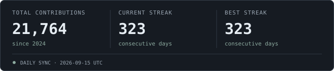

### <samp>Hey, I'm Amit ☁️</samp>

<p><samp>
I'm an AI/ML engineer, working from model training and LLM fine-tuning to production AI agents.<br>
I build computer vision models, RAG pipelines, and conversational systems that solve real-world problems.
</samp></p>

```text
work     AI agents · RAG · open source
tools    Python · PyTorch · FastAPI
based    New Delhi, India
offline  probably another game of chess
```

[](https://theamitchandra.github.io/My-Portfolio)
[](https://www.linkedin.com/in/connect-amit-chandra/)
[](mailto:ask.amitchandra@gmail.com)

<br clear="both">

<samp><strong>On my workbench</strong></samp>

[](https://neuralcleave.com/)
[](https://pypi.org/project/neuroagent-ai/)
[](https://pypi.org/project/neuromesh-ai/)

###  <samp>Between commits, chess.</samp>

<samp>My last 100 rated rapid games, one move at a time.</samp>

[](https://www.chess.com/member/thegeekyamit)

<!-- CHESS:START -->
<samp><strong>Rapid 1134</strong> · Personal best <strong>1336</strong></samp>

```text
RAPID / LAST 100 GAMES

1140 ┤
1132 ┤                                                                                                    ╭
1125 ┤                      ╭╮                                                                           ╭╯
1118 ┤ ─╮                  ╭╯╰╮╭╮  ╭╮                                                                   ╭╯
1110 ┤  ╰╮                 │  │││  ││                                          ╭╮  ╭╮                  ╭╯
1102 ┤   ╰╮    ╭╮     ╭╮╭╮╭╯  ╰╯╰╮╭╯╰╮                                  ╭╮╭╮╭╮╭╯╰╮╭╯╰╮               ╭─╯
1095 ┤    ╰╮  ╭╯╰╮   ╭╯╰╯╰╯      ╰╯  ╰╮                  ╭╮          ╭╮╭╯╰╯╰╯╰╯  ╰╯  ╰╮             ╭╯
1088 ┤     ╰╮╭╯  ╰╮╭─╯                ╰╮╭╮              ╭╯╰╮╭╮╭╮    ╭╯╰╯              ╰╮╭╮    ╭╮   ╭╯
1080 ┤      ╰╯    ╰╯                   ╰╯╰╮          ╭╮╭╯  ╰╯╰╯╰╮  ╭╯                  ╰╯╰╮╭╮╭╯╰╮ ╭╯
1072 ┤                                    ╰╮        ╭╯╰╯        ╰╮╭╯                      ╰╯╰╯  ╰─╯
1065 ┤                                     ╰╮╭╮╭╮  ╭╯            ╰╯
1058 ┤                                      ╰╯╰╯╰╮╭╯
1050 ┤                                           ╰╯

       31 Aug 2026 → 10 Sep 2026 · oldest to newest
```
<!-- CHESS:END -->

<sub><samp>Updated every 12 hours</samp></sub>

### <samp>A little every day.</samp>

[](https://github.com/TheAmitChandra?tab=overview)

<sub><samp>Public + shared private contributions · Streaks follow contribution-calendar days · Updated daily</samp></sub>

<br>

<p align="center">
  <a href="https://github.com/TheAmitChandra">
    
  </a>
</p>

<!-- Visual inspiration and anime GIF: https://github.com/innng/innng
     Chess history inspiration: https://github.com/sciencepal/sciencepal -->
