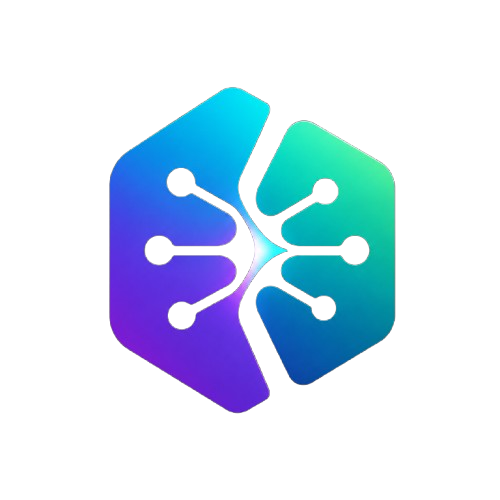

<p align="center">
  
</p>


<p align="center">
  
</p>

<p align="center">
  
</p>

<p align="center">
  <a href="https://www.linkedin.com/in/connect-amit-chandra/"></a>
  <a href="mailto:ask.amitchandra@gmail.com"></a>
  <a href="https://theamitchandra.github.io/My-Portfolio"></a>
  <a href="https://leetcode.com/Amit-Chandra/"></a>
  <a href="https://dev.to/amitchandra/"></a>
  <a href="https://www.hackerrank.com/profile/amitchandra/"></a>
</p>

<br/>

## 👨‍💻 About Me

```yaml
name     : Amit Chandra
role     : AI/ML Engineer @ Vervebot INC
location : New Delhi, India
education: B.Tech — Computer Science & Engineering
focus    : AI Agents · RAG Systems · LLM Fine-tuning · Deep Learning · MLOps · PyPI
passion  : Building & training intelligent systems that solve real-world problems
```

From designing neural network architectures and curating datasets to fine-tuning LLMs and shipping production AI agents — I own the full ML lifecycle end to end. My work spans computer vision models, RAG pipelines, autonomous agents, and conversational systems, all built to solve real business problems at scale.


## 🔧 Tech Stack

<p align="center">


</br>


</br>


</br>


</br>


</br>


</br>


</br>


</br>

</p>


## 📊 GitHub Stats & Activity

<p align="center">
  
</p>
<p align="center">
  
</p>
<p align="center">
  
  
</p>


## 🚀 Featured Projects

### 📦 Open Source — NeuralCleave

<p align="center">
  
</p>

<p align="center">
  <a href="https://pypi.org/project/neuralcleave/">
    
  </a>
  <a href="https://docs.neuralcleave.com/">
    
  </a>
  <a href="https://neuralcleave.com/">
    
  </a>
</p>

<p align="center">
  
  <a href="https://pepy.tech/project/neuralcleave"></a>
  
  
</p>

> A local-first personal AI assistant gateway — one agent connected to 32 messaging platforms simultaneously (Telegram, Discord, Slack, WhatsApp & 28 more), with a 3-tier memory system (Redis + Qdrant + SQLite), task-aware LLM routing across 13 providers (Claude, GPT-4, Gemini, DeepSeek & Ollama), voice support via Whisper, ReflectionEngine for auto-scored response quality, and a typed plugin SDK with hot-reload. Production-ready: v2.1.0, 5,064 passing tests.

<br/>

### 📦 Open Source — NeuroMesh AI

<p align="center">
  <a href="https://pypi.org/project/neuromesh-ai/">
    
  </a>
  <a href="https://theamitchandra.github.io/NeuroMesh-AI/">
    
  </a>
</p>

<p align="center">
  
  <a href="https://pepy.tech/project/neuromesh-ai"></a>
  
  
</p>

> AI-powered recommendation engine published on PyPI — build intelligent recommendation systems with advanced ML algorithms, collaborative filtering, and deep learning. Production-ready, battle-tested.

<br/>

### 📦 Open Source — NeuroAgent AI

<p align="center">
  <a href="https://pypi.org/project/neuroagent-ai/">
    
  </a>
  <a href="https://theamitchandra.github.io/NeuroAgent-AI/">
    
  </a>
</p>

<p align="center">
  
  <a href="https://pepy.tech/project/neuroagent-ai"></a>
  
  
</p>

> The FastAPI of AI Agents — a provider-agnostic Python framework for building production-ready AI agents, multi-agent teams, RAG pipelines, and DAG-based workflows across OpenAI, Anthropic, Gemini, Groq & more, with built-in memory, observability, and one-line HTTP deployment.

<br/>

### 🤖 AI Agents & Intelligent Systems

| | Project | Description | Stack | Status |
|---|---------|-------------|-------|--------|
| 🧠 | **SchemaMind** | AI agent for businesses — connect your database and ask anything in natural language using LLMs + RAG | `LangChain` `OpenAI` `FastAPI` `RAG` |  |
| 🧠 | **RecoForge Edge** | Browser-native recommendation intelligence. Privacy-first, cross-platform, powered by LLaMA 3.2 3B + RL | `Django` `LLaMA` `RL` `Next.js` |  |
| ✈️ | **Tripmind** | Full-stack AI travel platform with smart itinerary planning, real-time booking & conversational AI | `Next.js` `Django` `OpenAI` `PostgreSQL` |  |

<br/>

### 💻 ML Applications & Web Projects

| | Project | Description | Stack | Link |
|---|---------|-------------|-------|------|
| 📊 | **Content Recommendation System** | Production-grade hybrid recommendation engine. Collaborative filtering + deep learning. Real-time user behavior analysis, <100ms latency | `TensorFlow` `Flask` `Redis` `Python` | [](https://content-recommendation-system.onrender.com/) |
| 🌾 | **AI Crop Recommendation** | ML-powered crop selection for farmers. Analyzes soil, climate & regional data for optimal yield predictions | `Scikit-learn` `Pandas` `Flask` `Python` |  |
| 🧩 | **Sudoku Solver** | Upload a Sudoku image or enter manually — CV model extracts digits, scikit-learn handles recognition, custom backtracking algorithm solves it. Downloadable results, error handling, polished UI | `Flask` `OpenCV` `scikit-learn` `Pillow` `JavaScript` | [](https://sudoku-solver-fv8o.onrender.com/) |
| 🎯 | **AI Customer Support Agent** | Enterprise-grade RAG-powered support agent. Learns from knowledge base & historical tickets to auto-resolve tier-1 queries, analyze customer sentiment, detect churn risk, and escalate to humans when needed. Integrates with Zendesk, Freshdesk & Intercom | `RAG` `LangChain` `OpenAI` `FastAPI` `Vector DB` |  |

<br/>

### 🎮 Classic Games Collection

| | Game | Description | Tech | Play |
|---|------|-------------|------|------|
| 🐍 | **Snake Game** | Classic snake with smooth controls, score tracking & increasing difficulty | `JavaScript` `Canvas API` | [](https://github.com/TheAmitChandra/Snake-Game) |
| 🧱 | **Brick Breaker** | Arcade-style brick breaker with physics, power-ups & multiple levels | `JavaScript` `Canvas API` | [](https://github.com/TheAmitChandra/Brick-Breaker) |
| 🏓 | **Pong Game** | Two-player Pong with smooth paddle controls & real-time collision detection | `JavaScript` `Canvas API` | [](https://github.com/TheAmitChandra/Pong-Game) |


## 📬 Let's Connect

<p align="center">
  <a href="https://www.linkedin.com/in/connect-amit-chandra/"></a>
  <a href="mailto:ask.amitchandra@gmail.com"></a>
  <a href="https://theamitchandra.github.io/My-Portfolio"></a>
  <a href="https://leetcode.com/Amit-Chandra/"></a>
  <a href="https://dev.to/amitchandra/"></a>
  <a href="https://www.hackerrank.com/profile/amitchandra/"></a>
</p>

<p align="center">
  <i>Open to collaborating on AI/ML projects, LLM-based systems, and innovative open-source work. Don't hesitate to reach out!</i>
</p>

<p align="center">
  
</p>


